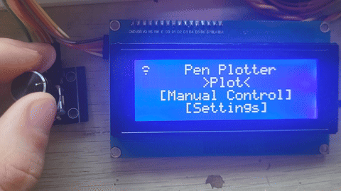

# PenPlotter Firmware

Firmware für einen CoreXY-Stiftplotter auf Basis des ESP32-Mikrocontrollers. Entwickelt mit PlatformIO (Arduino + FreeRTOS), geschrieben in C++20.

## Funktionsübersicht

- **Web-Interface** zur Dateiübertragung und Fernsteuerung über WLAN
- **LCD-Benutzeroberfläche** (20×4 Zeichen) mit Drehgeber-Navigation
- **G-Code-Ausführung** mit Unterstützung für Linien, Kreisbögen sowie quadratische und kubische Bézierkurven

---

## Hardware

| Komponente          | Details                                          |
|---------------------|--------------------------------------------------|
| Mikrocontroller     | ESP32 (DOIT DevKit V1)                           |
| Schrittmotortreiber | TMC2209 (UART-gesteuert, R_SENSE = 0,11 Ω)      |
| Display             | 20×4 I²C LCD (Adresse 0x27, SDA=21, SCL=22)     |
| Eingabe             | Drehgeber mit Taster (DT=26, CLK=27, SW=25)      |
| Stiftaktor          | Servo an Pin 13                                  |
| Summer              | Passiver Buzzer an Pin 14                        |
| Motor A / B         | STEP=19/18, DIR=4/5, Enable=23, UART TX=17 RX=16 |

**Arbeitsbereich**: 185 mm × 265 mm · **Schritte/mm**: 5,0 (16-fach Mikroschritt, 1000 mA) · Sensorloses Homing via TMC2209-StallGuard – keine physischen Endschalter.

---

## Unterstützte G-Code-Befehle

| Befehl        | Funktion                                                            |
|---------------|---------------------------------------------------------------------|
| `G0` / `G1`   | Linearbewegung (Eilgang / Zeichnen), Parameter: `X`, `Y`, `F`      |
| `G2` / `G3`   | Kreisbogen (im/gegen Uhrzeigersinn), Parameter: `X`, `Y`, `I`, `J` |
| `G5` / `G5.1` | Quadratische / Kubische Bézierkurve                                 |
| `G28`         | Alle Achsen referenzfahren (Homing)                                 |
| `G90` / `G91` | Absolut- / Relativmodus                                             |
| `M3` / `M5`   | Stift absenken (65°) / heben (100°)                                 |

---

## Web-Interface

Das Gerät verbindet sich mit dem konfigurierten WLAN und ist unter `penPlttr.local` erreichbar (mDNS-Name konfigurierbar).

- **HTTP-Server** (Port 80): G-Code-Dateien hochladen (max. 10 MB), Druckaufträge starten, Aufträge pausieren/abbrechen, einzelne G-Code-Befehle senden, alle Laufzeit-Einstellungen als JSON lesen und schreiben.
- **WebSocket-Server** (Port 81): Einseitiger Livestream des Maschinenzustands (Position, Fortschritt, Stiftzustand) an verbundene Clients.

---

## Benutzeroberfläche (LCD)

Die UI basiert auf einem selbst entwickelten widget- und layoutbasierten UI-Framework für Charakterdisplays (`src/ui/framework/`), das Fokus-Management, Eingabeverarbeitung, ein Router-System für Screens sowie wiederverwendbare Widgets umfasst.

Die UI wird über einen Drehgeber gesteuert (drehen = navigieren/Wert ändern, drücken = bestätigen) sie hat drei funktionen:

- **Druckaufträge** – Datei auswählen und Druck starten, laufenden Auftrag per Drehgeber pausieren oder abbrechen, Fortschritt in Prozent verfolgen
- **Manuelle Steuerung** – Achsen manuell verfahren, Stift heben/senken
- **Einstellungen** – alle konfigurierbaren Parameter direkt am Gerät ändern

Akustisches Feedback über den Buzzer: kurze Melodie bei Auftragsstart, -abschluss und -abbruch.

---

## Einstellungen & Konfiguration

Einstellungen sind dreistufig aufgebaut: Compile-Zeit-Standardwerte → Laufzeit-Einstellungen (`RuntimeSettings`) → persistierte Werte im Flash (`SettingPersistence`, NVS). Beim Start werden gespeicherte Werte geladen; Änderungen werden sofort in den Laufzeit-Einstellungen wirksam und über das **Observer-Pattern** an betroffene Komponenten propagiert.

Konfigurierbare Parameter: Treiberstrom, Mikroschritt-Auflösung, Vorschubgeschwindigkeiten, Homing-Parameter (StallGuard-Schwellwert, Rückfahrschritte, Timeout), Servo-Winkel, Stiftplatz-Daten (Farbe, Strichbreite), WLAN-Zugangsdaten, mDNS-Name.

---

## Architektur

Der ESP32 führt zwei FreeRTOS-Tasks auf getrennten Kernen aus:

| Task             | Kern   | Takt   | Zuständigkeit                                                       |
|------------------|--------|--------|---------------------------------------------------------------------|
| `plottingTask`   | Core 1 | 1 ms   | G-Code lesen & parsen, Bewegungen ausführen, Schrittgenerierung     |
| `systemTask`     | Core 0 | 10 ms  | UI, Web-Interface, Einstellungen, Dateisystem                       |

**Kommunikation zwischen den Tasks:**

- **`RtosQueue<GcodeMessage>`** (Tiefe 32): Core 0 liest G-Code-Zeilen aus einer Datei auf LittleFS und schreibt sie in die Queue. Core 1 liest daraus und führt die Befehle aus. Die Queue entkoppelt Datei-I/O von der zeitkritischen Bewegungssteuerung.
- **`MotionState`** (gemeinsames Struct, thread-safe via `std::atomic`): Dient in beide Richtungen. Core 0 schreibt Hochprioritäts-Befehle (`PAUSE`, `ABORT`) in ein Kommando-Feld, das Core 1 bei jedem Tick auswertet und darauf reagiert, indem er seinen Zustand (`IDLE`, `RUNNING`, `PAUSED`) aktualisiert. Zusätzlich schreibt Core 1 kontinuierlich Maschinendaten (Position, Stiftzustand), die Core 0 für die LCD-Anzeige und den WebSocket-Livestream liest.

---

## Abhängigkeiten

| Bibliothek  | Zweck                               |
|-------------|-------------------------------------|
| TMCStepper  | TMC2209-Treiberkommunikation (UART)  |
| LCD-I2C     | I²C LCD-Ansteuerung                 |
| ESP32Servo  | Servo-PWM                           |
| WebSockets  | WebSocket-Server (Port 81)          |
| LittleFS    | Dateisystem auf ESP32-Flash         |

---

## Konfiguration (`src/config/`)

Hardwarespezifische Compile-Zeit-Konstanten:

| Datei                   | Inhalt                                     |
|-------------------------|--------------------------------------------|
| `HardwareConfig.hpp`    | Arbeitsbereich, Schritte/mm, Strom         |
| `PinsConfig.hpp`        | Pin-Belegung aller Komponenten             |
| `PenSlotsConfig.hpp`    | Anzahl der Stiftplätze                     |
| `DirectoriesConfig.hpp` | Verzeichnisnamen im Dateisystem            |
| `UiConfig.hpp`          | Display-Adresse, Entprellzeit              |
| `VersionConfig.hpp`     | Firmware-Version                           |

Standard-Laufzeitwerte in `src/settings/defaults/`.
